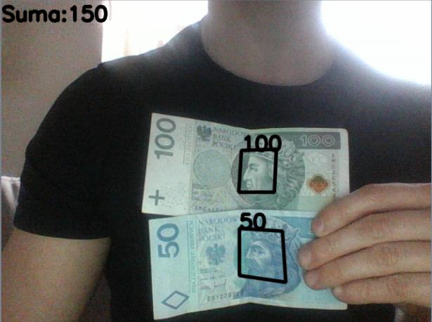
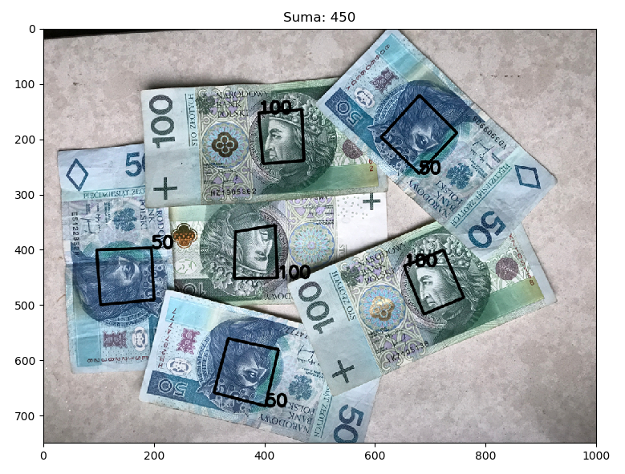
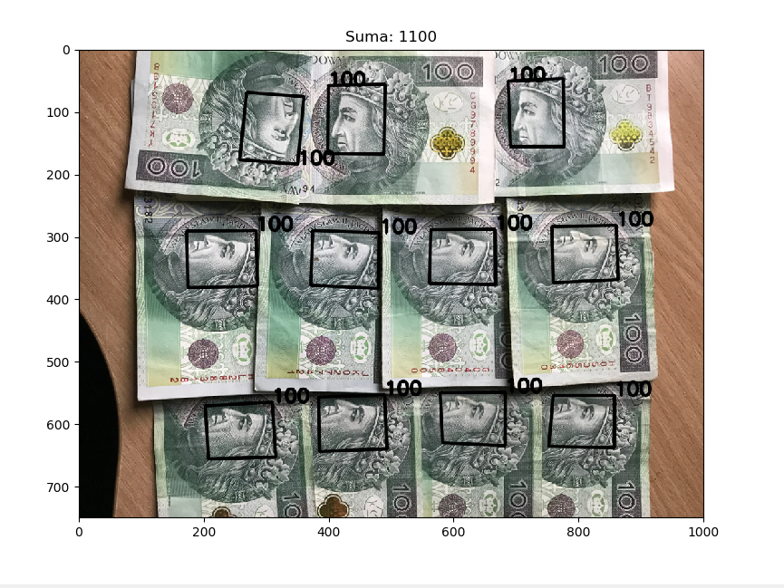
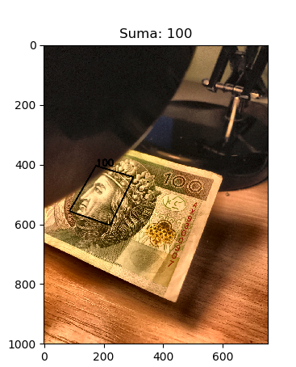
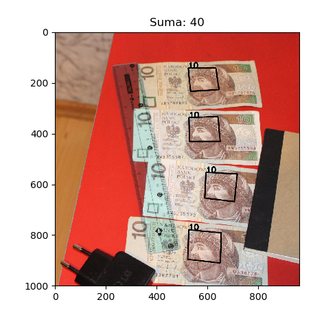
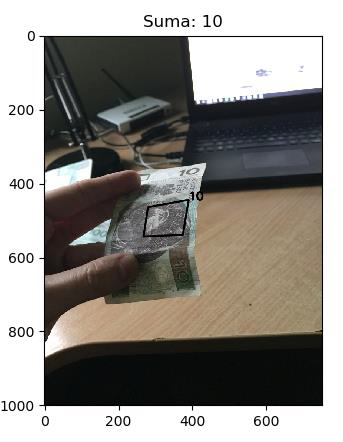
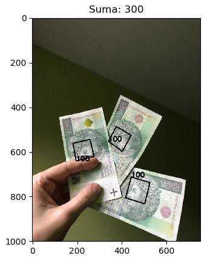

# NotesRecognizer
Python script capable of recognizing polish banknotes in images.

There are two versions, one for analysing static photos and one processing webcam input to give you sort of real-time response.

Here are some example outputs:

